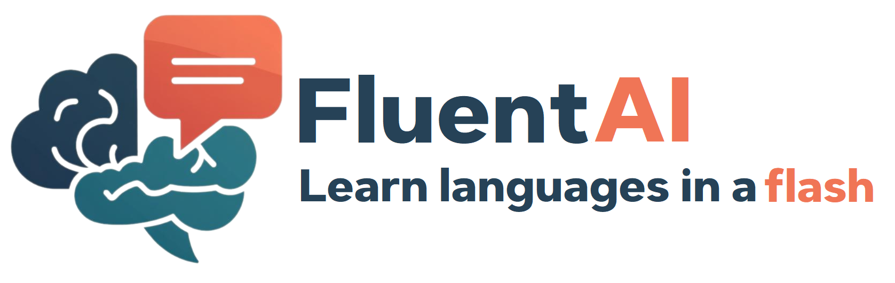
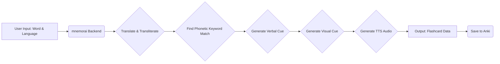

# mnemorai: remember more with mnemorai 🧠



<p align="center">
  <strong>Learn languages faster and remember more with AI-powered mnemonic flashcards seamlessly integrated into Anki.</strong>
</p>

<p align="center">
  
  
  <a href="https://github.com/psf/black"></a>
  <a href="https://discord.gg/z56zRXtNR5"></a>
</p>

---

Tired of rote memorization? **mnemorai** leverages the power of AI to create unique, memorable connections for new vocabulary. Inspired by the research paper [SmartPhone: Exploring Keyword Mnemonic with Auto-generated Verbal and Visual Cues](https://arxiv.org/pdf/2305.10436.pdf), this tool automatically generates:

*   **Phonetic Keyword Matches:** Finds words in your native language that sound similar to the target word.
*   **Engaging Verbal Cues:** Creates short, catchy sentences linking the keyword and the target word's meaning.
*   **Vivid Visual Cues:** Generates unique images based on the verbal cue to create strong memory anchors.
*   **Anki Integration:** Saves these rich flashcards directly into your Anki decks.

**The result?** More effective, engaging, and scientifically-backed language learning.

➡️ **Explore the [Wiki](https://github.com/StephanAkkerman/mnemorai/wiki) for detailed documentation.** <br/>
➡️ **See the list of [Supported Languages](https://github.com/StephanAkkerman/mnemorai/wiki/Supported-languages).**

## Table of Contents 🗂

*   [Key Features](#key-features-)
*   [How it Works](#how-it-works-%EF%B8%8F)
*   [Demo](#demo-)
*   [The Science Behind It](#the-science-behind-it-)
*   [System Requirements](#system-requirements-%EF%B8%8F)
*   [Installation](#installation-%EF%B8%8F)
*   [Usage](#usage-%EF%B8%8F)
*   [Docker](#docker-)
*   [Citation](#citation-%EF%B8%8F)
*   [Contributing](#contributing-)
*   [License](#license-)
*   [Contact](#contact-)

## Key Features ✨

*   **🤖 AI-Powered Mnemonics:** Automatically generates phonetic keywords, verbal cues, and visual aids.
*   **🖼️ Custom Image Generation:** Creates unique images tailored to each mnemonic cue using models like SDXL-Turbo or Sana.
*   **🗣️ Text-to-Speech:** Includes audio pronunciation for target words.
*   **🃏 Anki Integration:** Seamlessly saves generated flashcards to your specified Anki deck via AnkiConnect.
*   **🔧 Model Customization:** Choose preferred LLMs and Image Generation models (via `config.yaml`).
*   **🌐 Multi-Language Support:** Designed to work with a growing list of languages.
*   **💻 Optional Web UI:** Includes a Next.js frontend for easy card generation and library browsing.
*   **Gpu Offloading:** Automatically manages GPU memory to run larger models on systems with limited VRAM (experimental).
*   **Gpu Quantization:** Supports 4-bit and 8-bit quantization for reduced memory usage (experimental).
*   **❤️ Open Source:** Free to use, modify, and contribute to!

## How it Works ⚙️

mnemorai streamlines the mnemonic creation process:



1.  **Input:** You provide a word and its language.
2.  **Processing:** The backend translates the word, finds a phonetically similar keyword in English, generates a linking sentence (verbal cue) using an LLM, and creates an image based on that sentence.
3.  **Output:** A complete flashcard package (word, translation, IPA, keyword, verbal cue, image, audio) is prepared.
4.  **Anki Sync:** The flashcard is sent to your running Anki instance via AnkiConnect and added to your chosen deck.

## Demo 🎬

See mnemorai in action!

https://github.com/user-attachments/assets/89927ebb-91b2-4883-bd65-df8b3706852d

## The Science Behind It 🔬

mnemorai utilizes the **Keyword Mnemonic** technique, a scientifically validated method for vocabulary acquisition. It works by creating an acoustic link (a similar-sounding keyword in your native language) and an imagery link (a mental image connecting the keyword to the target word's meaning). This dual-coding approach enhances memory encoding and retrieval.

Our implementation automates this process using AI, drawing inspiration from the methodologies presented in the [SmartPhone paper](https://arxiv.org/pdf/2305.10436.pdf).

## System Requirements 🖥️

**Operating System:**

*   Tested on: Ubuntu 24.04 LTS
*   Likely Compatible: Other Linux distributions, macOS. Windows via WSL2 might work but is untested.

**Hardware (Backend):**

*   **Minimum (for GPU acceleration):**
    *   **CPU:** Modern multi-core processor (e.g., AMD Ryzen 7 7000 series / Intel Core i7 12th Gen or newer recommended)
    *   **RAM:** 32 GB recommended (16 GB might work but could lead to swapping)
    *   **GPU:** NVIDIA GPU with **at least 12 GB VRAM** (e.g., RTX 3060 12GB, RTX 4070, RTX 3090/4090). **VRAM is the most critical factor.**
    *   **Storage:** ~20-50 GB free space for models and dependencies.
*   **Minimum (CPU Only):**
    *   **CPU:** Modern multi-core processor.
    *   **RAM:** 16 GB+
    *   **Storage:** ~10-20 GB free space.
    *   **Note:** Running on CPU only is **significantly slower** (minutes per card vs. seconds on GPU).
*   **Recommended:**
    *   **CPU:** Faster multi-core processor.
    *   **RAM:** 32 GB or more.
    *   **GPU:** NVIDIA GPU with 16 GB+ VRAM (e.g., RTX 4080/4090) for faster generation and potentially larger models.

**Software:**

*   Python 3.9 or newer.
*   [Anki](https://apps.ankiweb.net/) (Desktop version) installed and running.
*   [AnkiConnect Add-on](https://foosoft.net/projects/anki-connect/) installed in Anki.
*   `pip` and `venv` (recommended for Python environment management).
*   (Optional Frontend) Node.js and npm/yarn.

## Installation 🛠️

1.  **Clone the Repository:**
    ```bash
    git clone https://github.com/StephanAkkerman/mnemorai.git
    cd mnemorai
    ```

2.  **Set up Python Environment (Recommended):**
    ```bash
    python -m venv venv
    source venv/bin/activate  # On Windows use `venv\Scripts\activate`
    ```

3.  **Install Backend Dependencies:**
    *   Navigate to the backend directory and install the dependencies.
    ```bash
    cd backend
    pip install .
    ```

4.  **Install GPU Dependencies (Highly Recommended):**
    *   Ensure you have NVIDIA drivers and CUDA toolkit compatible with PyTorch installed. See [PyTorch installation guide](https://pytorch.org/get-started/locally/).
    *   Install GPU-specific requirements:
        ```bash
        cd backend
        pip install -r gpu-requirements.txt
        ```

5.  **Configure AnkiConnect:**
    *   Open Anki, go to `Tools` -> `Add-ons` -> `AnkiConnect` -> `Config`.
    *   Restart Anki after changing the config.

6.  **(Optional) Install Frontend Dependencies:**
    ```bash
    cd frontend
    npm install
    cd ..
    ```

7.  **Configuration:**
    *   Copy `config.example.yaml` to `config.yaml`.
    *   Review `config.yaml` and adjust model names, paths, or API keys if necessary.

## Usage ▶️

1.  **Start Anki:** Ensure Anki desktop application is running with AnkiConnect installed.

2.  **Start the Backend API:**
    ```bash
    # Make sure your virtual environment is activated
    # source venv/bin/activate
    cd backend
    python mnemorai/api/app.py --config path/to/your/config.yaml
    ```
    The API will typically be available at `http://localhost:8000`.

3.  **Use the Frontend:**
    *   **Option A: Run Locally (if installed):**
        ```bash
        cd frontend
        npm run dev
        ```
        Access the web UI in your browser at `http://localhost:3000`.
    *   **Option B: Use the Demo Site:**
        Visit [https://demo.mnemorai.com](https://demo.mnemorai.com). This site will connect to **your locally running backend API** (`http://localhost:8000`). Ensure your backend is running first!

4.  **Generate Cards:** Use the web interface (local or demo) to input words and languages, customize models if desired, and generate your mnemonic flashcards. They will be automatically saved to your selected Anki deck.

## Docker 🐋

For a containerized setup, refer to the Docker instructions: [backend/docker/README.md](backend/docker/README.md).

## Citation ✍️

If you use mnemorai in your research or work, please cite it:

```bibtex
@misc{mnemorai,
  author       = {Stephan Akkerman and Winston Lam and Tim Koornstra},
  title        = {mnemorai: AI-Powered Mnemonic Flashcards for Language Learning},
  year         = {2024},
  publisher    = {GitHub},
  journal      = {GitHub repository},
  howpublished = {\url{https://github.com/StephanAkkerman/mnemorai}}
}
```

And consider citing the original paper that inspired this work:

```bibtex
@misc{lee2023smartphone,
      title={SmartPhone: Exploring Keyword Mnemonic with Auto-generated Verbal and Visual Cues},
      author={Jaewook Lee and Andrew Lan},
      year={2023},
      eprint={2305.10436},
      archivePrefix={arXiv},
      primaryClass={cs.CL}
}
```

## Contributing 🤝

Contributions are welcome! Whether it's bug reports, feature requests, or code contributions, please feel free to open an issue or pull request.

Please read [CONTRIBUTING.MD](CONTRIBUTING.md) for guidelines.

[](https://github.com/StephanAkkerman/mnemorai/graphs/contributors)

## License 📜

This project is licensed under the MIT License. See the [LICENSE](LICENSE) file for details.

## Contact 💬

Join our [Discord Community](https://discord.gg/z56zRXtNR5) to discuss the project, ask questions, and connect with other users!
