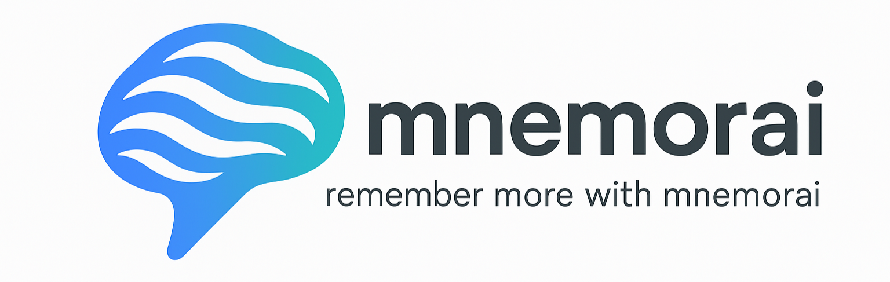

# mnemorai: remember more with mnemorai



<p align="center">
  
  
  <a href="https://github.com/psf/black"></a>
  <a href="https://discord.gg/z56zRXtNR5">
</p>

---

## Introduction

mnemorai is inspired by the method detailed in the paper [SmartPhone: Exploring Keyword Mnemonic with Auto-generated Verbal and Visual Cues by Jaewook Lee and Andrew Lan](https://arxiv.org/pdf/2305.10436.pdf). The aim is to recreate their approach using accessible, open-source models.
The pipeline they propose, as shown below, serves as the blueprint for our project. It illustrates the process of automating language learning, blending cutting-edge AI techniques with proven language learning methodology.


You can find our docs [here](https://github.com/StephanAkkerman/mnemorai/wiki) and the list of supported languages [here](https://github.com/StephanAkkerman/mnemorai/wiki/Supported-languages).

## Table of Contents 🗂

- [Prerequisites](#prerequisites-)
- [Installation](#installation-)
    - [Using `pip`](#using-pip)
    - [Building from Source](#building-from-source)
- [Usage](#usage-)
    - [Docker](#docker-) 
- [Citation](#citation-)
- [Contributing](#contributing-)
- [License](#license-)

## Prerequisites 📋

### Hardware
This project will work only if you have a Windows or Linux device with a GPU that supports CUDA. The recommended amount of VRAM to run mnemorai is minumum 8GB.

### Software
Before starting, make sure you have the following requirements:

- [Anki](https://apps.ankiweb.net/) installed on your device.
- [Anki-Connect](https://foosoft.net/projects/anki-connect/) This add-on allows you to add cards to Anki from the command line.
- [Python](https://www.python.org/downloads/) installed on your device (check the supported versions at the top).
- [React](https://react.dev) installed on your device (optional).

## Installation ⚙️

### Using `pip`

We have bundled all required dependencies into a package for easy installation. To get started, simply run one of the following commands:

```bash
pip install backend/. --extra-index-url https://download.pytorch.org/whl/cu128
```

### Building from Source

If you prefer to build from source, follow these steps:

1. Clone the repository:

   ```bash
   git clone https://github.com/StephanAkkerman/mnemorai.git
   ```

2. Navigate to the project directory:

   ```bash
   cd mnemorai
   ```

3. Install the dependencies:

   ```bash
   pip install backend/. --extra-index-url https://download.pytorch.org/whl/cu124
   ```

## Usage ⌨️

Using mnemorai is simple, after following the steps in [pre-requisites](#pre-requisites) you can start the back-end by executing the following command.
```bash
python mnemorai/services/card_gen/api.py
``` 

### Docker 🐋 (Optional)

You can also run mnemorai using Docker. This is a great option if you want to avoid installing dependencies directly on your machine. To do so follow the steps in the Docker [README](backend/docker/README.md).

### Running the Front-End (Optional)

If you would like to build and host the front-end yourself you can do so by executing these commands.

1. Navigate to the `frontend` directory:

   ```bash
   cd mnemorai/frontend
   ```

2. Install the necessary frontend dependencies:

   ```bash
   npm install
   ```

3. Build the front-end:

   ```bash
   npm run build
   ```

3. Start the development server:

   ```bash
   npm run dev
   ```

This will launch the front-end and connect it to the API for a seamless user experience.

## Citation ✍️

If you use this project in your research, please cite as follows:

```bibtex
@misc{mnemorai,
  author  = {Stephan Akkerman, Winston Lam, Tim Koornstra},
  title   = {mnemorai},
  year    = {2024},
  publisher = {GitHub},
  journal = {GitHub repository},
  howpublished = {\url{https://github.com/StephanAkkerman/mnemorai}}
}
```

## Contributing 🛠

Contributions are welcome! If you have a feature request, bug report, or proposal for code refactoring, please feel free to open an issue on GitHub. We appreciate your help in improving this project.
If you would like to make code contributions yourself, please read [CONTRIBUTING.MD](CONTRIBUTING.md).\


## License 📜

This project is licensed under the MIT License. See the [LICENSE](LICENSE) file for details.
